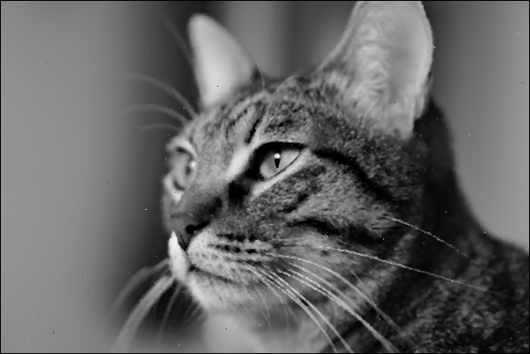

# Image Denoising in RISC-V Assembly

A grayscale image denoising program implemented in RISC-V assembly language for the Computer Architecture I course at Universidade de Évora.

## About

This project implements two image denoising algorithms (mean filter and median filter) entirely in RISC-V assembly language. The program processes 599×400 pixel grayscale images stored in GRAY format, removing noise through spatial filtering techniques.

## Technologies

**Language:** RISC-V Assembly  

## How to Run

### Prerequisites
- [RARS Simulator](https://github.com/TheThirdOne/rars)
- ImageMagick (for image conversion)

### Steps

**1. Convert input 599x400 image to GRAY format:**
   ```bash
   convert input.png -depth 8 input.gray
   ```

**2. Configure the program:**
   - Open `denoising_vfinal.asm` in RARS
   - Update the input filename in the `.data` section:
     ```assembly
     input_name_gray:  .string "your_input_file.gray"
     output_name_gray: .string "your_output_file.gray"
     ```

**3. Run the simulator:**
   - Enable: **Settings** → **Initialize Program Counter to 'global' main if defined**
   - Assemble: **Run** → **Assemble** (F3)
   - Execute: **Run** → **Go** (F5)

**4. Select filter:**
   - Choose option 1 (Mean) or 2 (Median) from the menu
   - Press 0 to exit

**5. Convert output back to viewable format:**
   ```bash
   convert -size 599x400 -depth 8 result.gray result.png
   ```

## Results

The program successfully removes noise from corrupted images:

| Original (Noisy) | Mean Filter | Median Filter |
|:---------------:|:-----------:|:-------------:|
|  |  |  |

The median filter produces superior results with less blurring compared to the mean filter.

## Grade

[]()

*Computer Architecture I - 2023/2024*  
*Universidade de Évora*

## Authors

- [**Miguel Pombeiro**](https://github.com/MiguelPombeiro)
- [**Miguel Rocha**](https://github.com/migueljfrocha)

---

## Additional Notes

- The program does not process image borders (set to black) to avoid boundary condition complexity
- Sorting algorithm used was Selection Sort (optimized for 9 elements)
- Division is implemented using successive subtractions to avoid using the `div` instruction
- The program only works with images with that specific size
