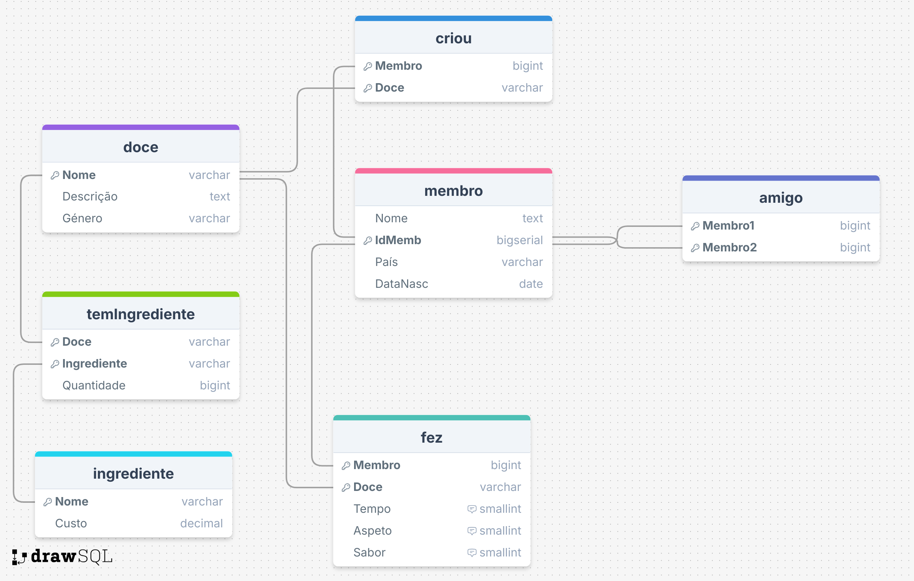

# Social Network: Sweets Fans - Database System

A relational database project developed for the **Databases** course at Universidade de Évora.

## About

This project implements the database for a specialized social network dedicated to dessert enthusiasts: **"Fãs de Doces"**. The system manages a community where members can friend each other, create new recipes, share ingredients lists, and rate the cooking attempts of various desserts based on time, appearance, and taste.

### Database Schema
The system consists of the following relations:
- **Membro:** Stores user profile data
- **Amigo:** Represents the undirected graph of friendships between members.
- **Doce:** Stores dessert recipes and genres (Regional, Traditional, etc.).
- **Ingrediente/TemIngrediente:** Manages the many-to-many relationship regarding recipe composition and ingredient costs.
- **Criou:** Tracks which member introduced a specific dessert to the platform.
- **Fez:** Logs cooking attempts, storing ratings for Time, Aspect, and Taste (1-5 scale).

Can be seen in the following diagram:



## Technologies

- **DBMS:** PostgreSQL
- **Language:** SQL
- **Concepts:** Relational Algebra

---

## How to Run

### Prerequisites
- PostgreSQL Database Server
- A SQL client

### Steps

1.  **Initialize the Database:**
    Open your SQL client and run the setup script. This creates the tables, sets up Foreign Keys, and inserts the sample data.
    ```sql
    \i 'table-creation-data-insertion.sql'
    ```

2.  **Execute Queries:**
    Run the queries file to generate the reports and answers for questions (a) through (o).
    ```sql
    \i 'queries.sql'
    ```

---

## Grade

[]()

*Databases - 2024/2025*  
*Universidade de Évora*

## Authors

- [**Miguel Pombeiro**](https://github.com/MiguelPombeiro)
- [**Miguel Rocha**](https://github.com/migueljfrocha)
