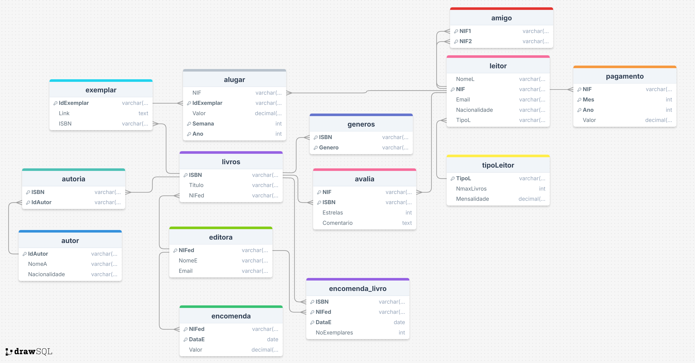
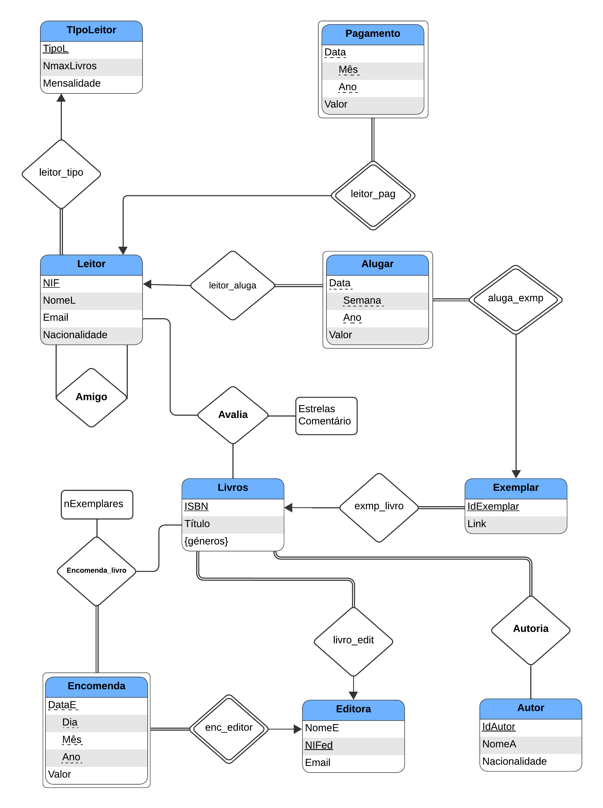

# Virtual Bookstore: E-Book Rental System

A relational database project developed for the **Databases** course at Universidade de Évora.

## About

This project implements the database backend for a **Virtual Bookstore** specialized in e-book rentals. The system covers the entire conceptual modeling process (ER Diagram), normalization (BCNF/3NF), and implementation in PostgreSQL.

### Database Schema
The system consists of the following key relations:
- **Leitor (Reader):** Stores profile data and subscription type.
- **Livros/Exemplar:** Manages the catalog of titles and specific digital copies available for rent.
- **Editora/Encomenda:** Tracks orders of new book copies from publishers.
- **Alugar:** Logs rental history by week and year.
- **Pagamento:** Records monthly settlements (subscription fee + rental fees).
- **Social Tables:** `Amigo` (Friends) and `Avalia` (Ratings).

Can be seen in the following diagram:



### ER Diagram
The conceptual design of the database:



## Technologies

- **DBMS:** PostgreSQL
- **Language:** SQL
- **Concepts:** Entity-Relationship Modeling, Normalization, Relational Algebra

---

## How to Run

### Prerequisites
- PostgreSQL Database Server
- A SQL client (psql, pgAdmin, DBeaver, etc.)

### Steps

1.  **Initialize the Database:**
    Open your SQL client and run the setup script. This creates the tables (with Foreign Key constraints) and populates them with sample data (Readers, Books, Rentals, etc.).
    ```sql
    \i 'table-creation-data-insertion.sql'
    ```

2.  **Execute Queries:**
    Run the queries file to generate the reports and answers for the assignment questions (a through t).
    ```sql
    \i 'queries.sql'
    ```

---

## Grade

[]()

*Databases - 2024/2025*  
*Universidade de Évora*

## Authors

- [**Miguel Pombeiro**](https://github.com/MiguelPombeiro)
- [**Miguel Rocha**](https://github.com/migueljfrocha)
