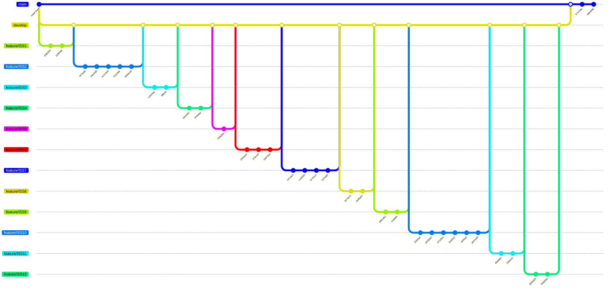

# Eventastic - Event Management System

A backend system for managing event lifecycles, registrations, and payments, built with Java for the Methods and Software Development course at Universidade de Évora.

## About

This project implements a system named **Eventastic**, designed to centralize information related to events, such as conferences, workshops, and meetups. It allows administrators to manage events and registration phases, while participants can register and track their payment status.

The project was developed in two phases:
1.  **Specification:** Requirement analysis, use case definitions, and UML modeling, originally made in the repository wiki.
   
2.  **Implementation:** Java implementation acting as a library/API with a CLI demonstration, following the specification made in the first phase and its constraints.

## Technologies

- **Language:** Java 21
- **Build Tool:** Maven
- **Testing:** JUnit 5

## How to Run

### Prerequisites
- Java 21+
- Maven

### Steps

To run the project:

```bash
mvn exec:java
```

### Workflow Visualization
Since the original commit history is not available here, the following graph illustrates the branching and versioning strategy used during development:



## Grade

**Part 1**: 

[]()

**Part 2**:

[]()

*Methods and Software Development - 2025/2026*  
*Universidade de Évora*

## Authors

- [**Miguel Pombeiro**](https://github.com/MiguelPombeiro)
- [**Miguel Rocha**](https://github.com/migueljfrocha)

---

## Additional Notes

The first phase was implemented in the wiki of the submitted repository, which had to be taken down, but its contents are preserved as Markdown files.

In the second phase, the goal was to create issues to implement the use cases and manage branches and versions with regular commits. Since the original repository is no longer available here, that workflow is represented as a graph.
